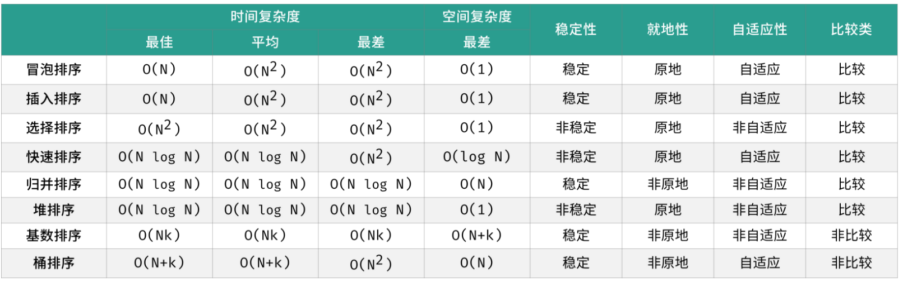

## 代码简介

### 排序算法(sort)
- 简介：
排序算法用作实现列表的排序，列表元素可以是整数，也可以是浮点数、字符串等其他数据类型
- 常见排序规则：
  - 整数排序： 对于一个整数数组，我们希望将所有数字从小到大排序；
  - 字符串排序： 对于一个姓名列表，我们希望将所有单词按照字符先后排序；
  - 自定义排序： 对于任意一个 已定义比较规则 的集合，我们希望将其按规则排序；
- 常见的排序算法：常见排序算法包括「冒泡排序」、「插入排序」、「选择排序」、「快速排序」、「归并排序」、「堆排序」、「基数排序」、「桶排序」
  - 
