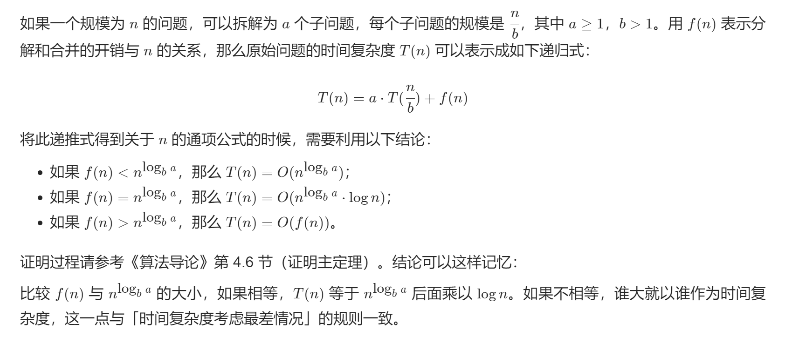
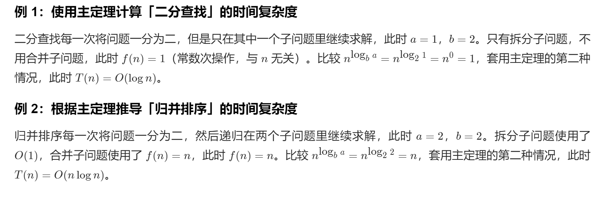
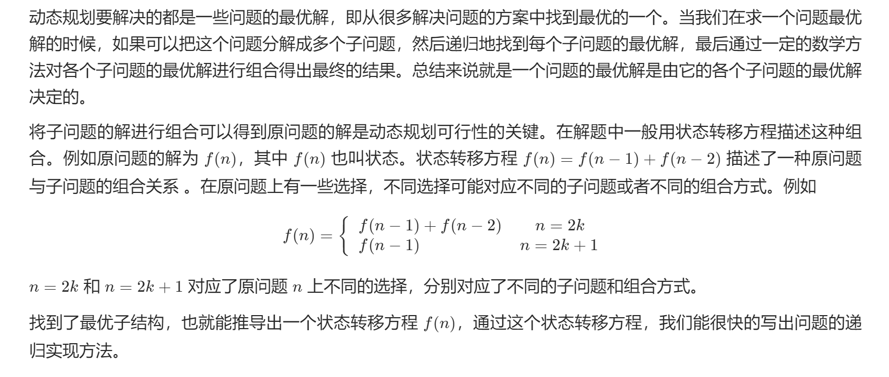
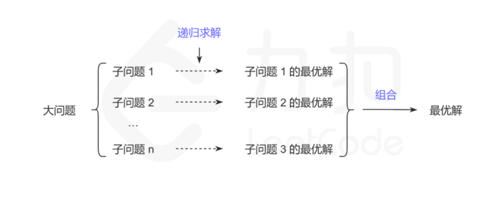
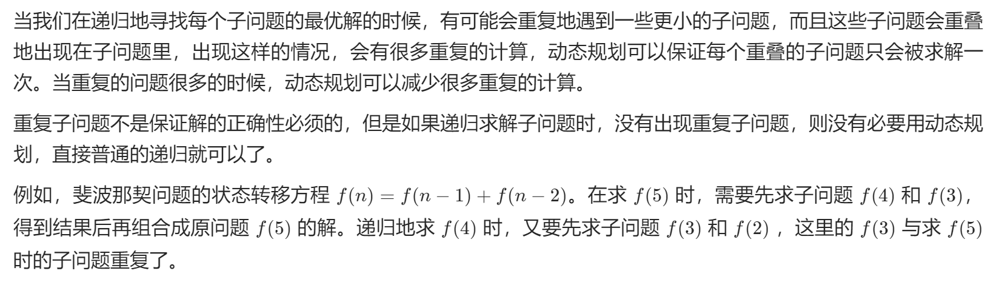
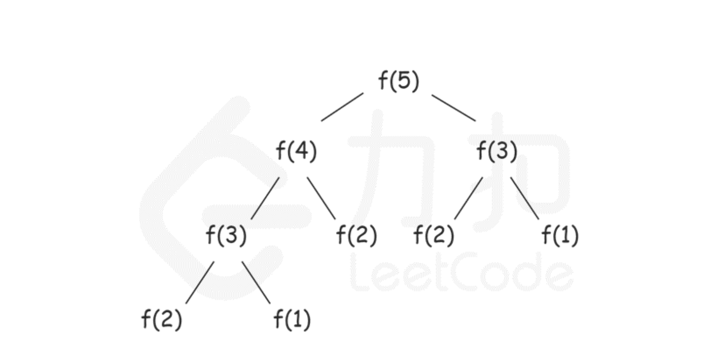
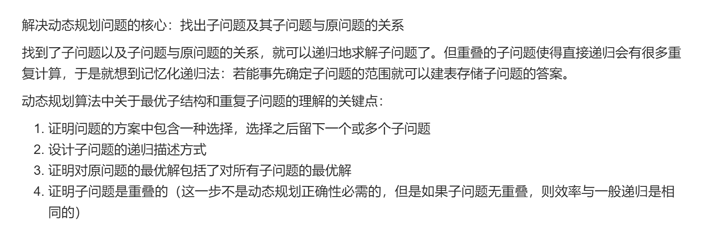
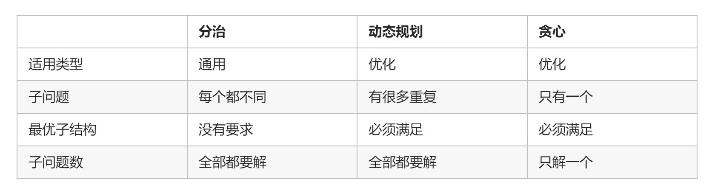
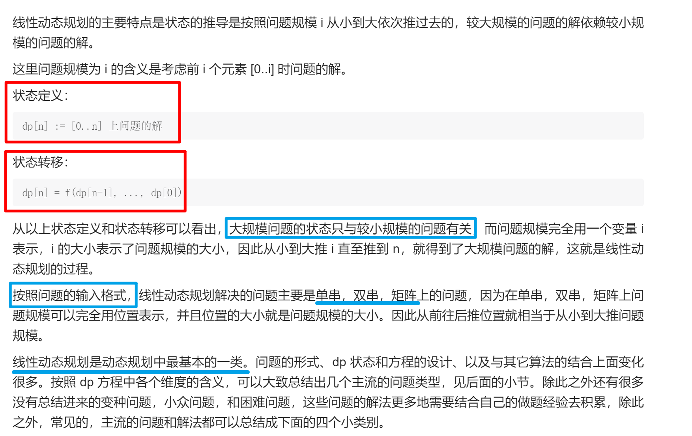

# 项目简介

> 大二小白自学数据结构与算法  
> [题目均来自leetcode](https://leetcode.cn/)

# 学习内容：六大算法思想

1. 贪心算法
2. 递归算法
3. 回溯算法
4. 分治算法
5. 动态规划
6. 枚举算法
    
    
    

## 贪心算法（greedy）

> [笔记参考及题目来源地址](https://leetcode.cn/leetbook/read/greedy/r28jah/)

1. 可以使用「贪心算法」的问题需要满足的条件
    1. 最优子结构：规模较大的问题的解由规模较小的子问题的解组成，区别于「动态规划」，可以使用「贪心算法」的问题「规模较大的问题的解」只由其中一个「规模较小的子问题的解」决定；
    2. 无后效性：后面阶段的求解不会修改前面阶段已经计算好的结果；
    3. 贪心选择性质：从局部最优解可以得到全局最优解。
2. 小结
    1. 「贪心算法」总是做出在当前看来最好的选择就可以完成任务；
    2. 解决「贪心算法」几乎没有套路，到底如何贪心，贪什么与我们要解决的问题密切相关。因此刚开始学习「贪心算法」的时候需要学习和模仿，然后才有直觉，猜测一个问题可能需要使用「贪心算法」，进而尝试证明，学会证明。
3. 代码练习: package --> src/main/java/jason/greedy
    1. ATheoreticalBasic &nbsp;&nbsp;--->&nbsp;&nbsp;贪心算法的理论知识
    2. BChangeProblem&nbsp;&nbsp;--->&nbsp;&nbsp;找零钱问题
    3. CRegionSelectionProblem &nbsp;&nbsp;--->&nbsp;&nbsp;区域选择问题
    4. DJumpProblem &nbsp;&nbsp;--->&nbsp;&nbsp; 跳跃问题
    5. EUsualProblemOfGreed &nbsp;&nbsp;--->&nbsp;&nbsp; 总结与练习--基础题
    6. FProblemOfAdvancedGreed &nbsp;&nbsp;--->&nbsp;&nbsp; 总结与练习--进阶题

## 递归/分治/会溯算法

> [笔记参考及题目来源地址](https://leetcode.cn/leetbook/read/recursion-and-divide-and-conquer/r24abc/)

### 分而治之的算法设计思想

1. 递归 与 分治
    1. 递归是编程技巧，直接体现在代码上 ，即函数自己调用自己；在调用的函数执行完毕之后，程序会回到产生调用的地方，继续做一些其他事情。调用的过程被称作为递归，返回的过程被称作为回溯。
    2. 分治是一种算法设计的思想，将大问题分解成多个小问题，例如归并排序将大问题：「排序整个数组」，分解为小问题：「排序左半和右半」；绝大部分情况下「分治算法」通过「递归」实现。即：子问题的求解通过递归方法实现。
2. 递归函数的设计思想：分而治之（减而治之）
    1. 分而治之（Divide-and-Conquer）的思想分为如下三步：
        1. 拆分：将原问题拆分成若干个子问题；
        2. 解决：解决这些子问题；
        3. 合并：合并子问题的解得到原问题的解。
    2. 「分治思想」的特例是「减治思想（Decrease-and-Conquer）」：每一步将问题转换成为规模更小的子问题。
    3. 「减治思想」思想的典型应用是「二分查找」「选择排序」「插入排序」「快速排序」算法。
    4. 「分治」与「减治思想」的区别如下：
        1. 分治思想：将一个问题拆分成若干个子问题，然后再逐个求解，根据各个子问题得到的结果得到原问题的结果；
        2. 减治思想：在拆分子问题的时候，只将原问题转化成 一个
           规模更小的子问题，因此子问题的结果就是上一层原问题的结果，每一步只需要解决一个规模更小的子问题，相比较于「分治思想」而言，它
           没有「合并」的过程。
3. 自顶向下地解决问题
    1. 使用「递归」的思想解决问题的方案是：从「结果」推向「源头」，再从「源头」返回「结果」。
4. 递归为什么需要使用栈？
    1. 后拆分的子问题先得到了解决，整个过程恰好符合「后进先出」的规律 ，因此需要借助的数据结构是「栈」。
5. 拆分的时候「先走出去」，合并的时候「再走回来」
    1. 使用「递归」实现的算法需要走完下面两条路径：
        1. 先「自顶向下」拆分问题，直到不能拆分为止；
        2. 再「自底向上」逐层把底层的结果向上汇报，直至得到原问题的解。
    2. 总结
        1. 「分治」是思想，「减治」是分治的特例；
        2. 「递归」是代码表现形式；
        3. 「递归」有先拆分问题的过程，真正解决问题，需要在拆分到底以后，一层一层向上返回。
6. 递归 与 地推
    1. 「自顶向下」与「递归」：「自顶向下」是直接面对我们要解决的问题，逐层拆分，直到不能拆分为止，再按照拆分的顺序的逆序逐层解决，直至原问题得到了解决，这是「递归」。
    2. 「自底向上」与「递推」：如果我们非常清楚一个问题最开始的样子，并且也清楚一个问题是如何从它最开始的样子逐步演变成为我们想要求解的问题的样子，我们就可以通过「递推」的方式，从小规模的问题开始逐步「递推」得到最终要解决的大问题的解。
    3. 个人理解：递归 --> 先拆分问题，再解决问题（存在回溯）； 递推 --> 直接一步步解决问题（不存在回溯）
7. 代码练习：package --> src/main/java/jason/recursion

### 递归函数的基本结构

1. 基本结构
    1. 写出递归终止条件（易忽略）
        1. 首先写出递归终止条件，也就是先写出不能再拆分的子问题。有些朋友在初学的时候，会由于忘记编写递归终止条件而导致递归调用栈满。
    2. 将原问题拆分成为规模更小的子问题（重点）
        1. 这一步是编写递归函数的关键，如何拆分子问题是我们需要关注的重点。
    3. 将子问题的结果进行合并（难点）
        1. 有一些逻辑恰好是发生在递归函数调用返回以后，我们在这个时机还可以编写一些逻辑，使得我们求解原问题变得更加简单。
2. 写好递归的一些建议：学好「递归」和编写代码一样，需要经历一个先模仿、再学习、然后思考和练习的过程。
    1. 写好「递归」方法不是一朝一夕的事情，和学习所有的算法问题一样，我们需要通过大量的练习来理解写对「递归」方法的技巧和细节；
    2. 「递归」方法与「分治思想」「减治思想」「深度优先遍历」「栈」有着千丝万缕的联系，在编写「递归」方法的同时，要有意识地思考它们之间的关系；
    3. 如果一时半会不能理解「递归」函数的语义，建议在逻辑的关键部分编写打印输出语句，以理解递归函数的调用过程。
3. 小结：学习好递归的重要方法是：先模仿，再练习。其实绝大部分知识的学习都需要反复经历「模仿」和「练习」的步骤。然后才会有自己的思考和总结。

### 深入理解递归算法 -- part01

1. 使用「归并排序」实现排序数组:
    1. 「归并排序」将数组不断拆分，直到拆到不能再拆分为止（即数组只有 1 个元素的时候）。由于 1
       个元素的数组肯定是有序数组，然后我们「逐层向上」依次合并两个有序数组。通过这样的方式，我们实现了排序的功能。
    2. 「拆分」与「合并」就通过递归的方式，方便地实现了它们的逻辑。
2. 使用「快速排序」实现排序数组
    1. 「归并排序」在「拆分子问题」环节是「无脑地」进行拆分，然后我们需要在「合」的环节进行一些操作。而「快速排序」在「分」这件事情上做出了文章，因此在「合」的环节什么都不用做。
    2. 实现步骤
       1. 从数组中取出一个数，称之为基数（pivot） 
       2. 遍历数组，将比基数大的数字放到它的右边，比基数小的数字放到它的左边。遍历完成后，数组被分成了左右两个区域 
       3. 将左右两个区域视为两个数组，重复前两个步骤，直到排序完成
3. 小结
   1. 「快速排序」和「归并排序」都基于分治和递归的思想
   2. 其中“快排”的重心在分治，二“归并排序”的重心在递归
4. 代码练习：package ---> src/main/java/jason/recursion/BInDepthUnderstandingRecursionOne.java &&  src/main/java/jason/recursion/CInDepthUnderstandingRecursionOne.java

### 深入理解递归算法 -- part02,part03

1. 使用递归函数简化「链表」中「穿针引线」的操作
   1. package ---> src/main/java/jason/recursion/DInDepthUnderStandingRecursionTwo.java

2. 树的问题绝大多数都可以使用「分治思想」解决
   1. package ---> src/main/java/jason/recursion/EInDepthUnderStandingRecursionThree.java

### 函数递归复杂度分析--定理

## 动态规划

### 动态规划简介

#### 动态规划背景

> 1. 动态规划不是某一种具体的算法，而是一种算法思想：若要解一个给定问题，我们需要解其不同部分（即子问题），再根据子问题的解以得出原问题的解。
> 2. 应用这种算法思想解决问题的可行性，对子问题与原问题的关系，以及子问题之间的关系这两方面有一些要求，它们分别对应了最优子结构和重复子问题。

1. 最优子机构和重复子问题
   1. 最优子结构规定的是子问题与原问题的关系
      1. 
      2. 
   2. 重复子问题规定的是子问题与子问题的关系。
      1. 
      2. 
2. 小结： 
3. 个人理解：
   1. 可以简单理解为：子问题具有重复性的贪心算法
   2. 重难点：状态转移方程（即子问题的变化规律）

#### 动态规划与其它算法的关系
- 分治
  - 解决分治问题的时候，思路就是想办法把问题的规模减小，有时候减小一个，有时候减小一半，然后将每个小问题的解以及当前的情况组合起来得出最终的结果。例如归并排序和快速排序，归并排序将要排序的数组平均地分成两半，快速排序将数组随机地分成两半。然后不断地对它们递归地进行处理。 
  - 这里存在有最优的子结构，即原数组的排序结果是在子数组排序的结果上组合出来的，但是不存在重复子问题，因为不断地对待排序的数组进行对半分的时候，两半边的数据并不重叠，分别解决左半边和右半边的两个子问题的时候，没有子问题重复出现，这是动态规划和分治的区别。
- 贪心
  - 关于最优子结构
    - 贪心：每一步的最优解一定包含上一步的最优解，上一步之前的最优解无需记录
    - 动态规划：全局最优解中一定包含某个局部最优解，但不一定包含上一步的局部最优解，因此需要记录之前的所有的局部最优解
  - 关于子问题最优解组合成原问题最优解的组合方式
    - 贪心：如果把所有的子问题看成一棵树的话，贪心从根出发，每次向下遍历最优子树即可，这里的最优是贪心意义上的最优。此时不需要知道一个节点的所有子树情况，于是构不成一棵完整的树
    - 动态规划：动态规划需要对每一个子树求最优解，直至下面的每一个叶子的值，最后得到一棵完整的树，在所有子树都得到最优解后，将他们组合成答案
  - 结果正确性
    - 贪心不能保证求得的最后解是最佳的，复杂度低
    - 动态规划本质是穷举法，可以保证结果是最佳的，复杂度高

#### 线性动态规划
线性动态规划简介
> 用动态规划解决问题的过程有以下几个关键点：状态定义，状态的转移，初始化和边界条件。

> 状态定义: 就是定义子问题，如何表示目标规模的问题和更小规模的问题。 
> 例如常见的方法：定义状态 dp[n]，表示规模为 nn 的问题的解，dp[n - 1] 就表示规模为 n−1 的子问题的解。在实战中 dp[n] 的具体含义需要首先整理清楚再往下做。

> 状态转移: 就是子问题之间的关系  
> 例如定义好状态 dp[n]，此时子问题是 dp[n-1] 等，并且大规模的问题的解依赖小规模问题的解，此时需要知道怎样通过小规模问题的解推出大规模问题的解。这一步就是列状态转移方程的过程。一般的状态转移方程可以写成如下形式

> dp[n] = f(dp[i])  

> 其中 i < n 按照状态定义和状态转移的常见形式，可以对动态规划进行分类

> 其中线性动态规划的主要特点是状态的推导是按照问题规模 i 从小到大依次推过去的，较大规模的问题的解依赖较小规模的问题的解。 这里问题规模为 i 的含义是考虑前 i 个元素 [0..i] 时问题的解。

#### 单串

单串 dp[i] 线性动态规划最简单的一类问题，输入是一个串，状态一般定义为 dp[i] := 考虑[0..i]上，原问题的解，其中 i 位置的处理，根据不同的问题，主要有两种方式：

- 第一种是 i 位置必须取，此时状态可以进一步描述为 dp[i] := 考虑[0..i]上，且取 i，原问题的解；
- 第二种是 i 位置可以取可以不取

1. 依赖比 i 小的 O(1) 个子问题：dp[n] 只与常数个小规模子问题有关，状态的推导过程 dp[i] = f(dp[i - 1], dp[i - 2], ...)
2. 依赖比 i 小的 O(n) 个子问题：dp[n] 与此前的更小规模的所有子问题 dp[n - 1], dp[n - 2], ..., dp[1] 都可能有关系
